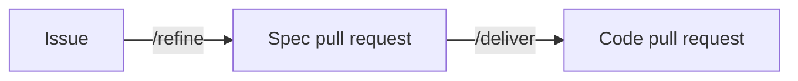

# Governed delivery with Claude Code

A way to have Claude Code build changes while people stay in charge of what is built. A brief starts as a
GitHub issue. `/refine` turns it into a specification with the person who raised it, and a pull request
approves it. `/deliver` then builds it test first, has it reviewed independently, and hands back a pull
request for a person to merge.


```mermaid
flowchart LR
  A["Issue"] -->|"/refine"| B["Spec pull request"]
  B -->|"/deliver"| C["Code pull request"]
```

Nothing is built until its specification is merged, and a person merges the result. Both steps run on
GitHub, started by a label, or on your own machine under your Claude subscription.

## Getting started

**1. Install.** Needs Node 22.12 or later, git, Python 3 and Claude Code.

```bash
git clone https://github.com/dibbdob/claude-code-governed-workflow.git
cd claude-code-governed-workflow
scripts/setup-machine.sh --plugin     # this machine: the tools, and the plugin
scripts/adopt.sh ../your-project      # your project: everything else, nothing committed
```

**2. Fit the project.** `adopt.sh` lists what to change. The essentials:

- Put the project's own build and tests in `build.sh`. It is the whole gate, and the workflow runs it before
  every commit.
- Have each test name the scenario it covers in its title, such as `[response-deadline] A ticket opened
  late on a Friday`.
- Rewrite the risk rule in `openspec/config.yaml` to name what is risky for your product.

**3. Set up GitHub**, if you use it:

- A ruleset on `main` requiring a pull request and the `build` check.
- The [Claude GitHub app](https://github.com/apps/claude) installed, and the secret `ANTHROPIC_API_KEY`.
- Write access for anyone who refines on GitHub.

[Setting up](docs/guide/setting-up.md) has the detail: what each script does, the full list to fit, and
the GitHub settings in full.

## Your first change

1. Write the issue in plain words. Add the `refine` label, or run `/refine 57` in a session. The change it
   writes is named after the issue, such as `57-bank-holidays`.
2. Answer Claude's questions, review the spec pull request, and merge it. The issue is now `ready`.
3. Add the `deliver` label, or run `./scripts/agent.sh 57`.
4. Read the pull request, starting with anything marked *Changed since approval*, and merge it.

## More

- [Refining](docs/guide/refining.md) and [delivering](docs/guide/delivering.md): the steps, and what to check
- [Reference](docs/guide/reference.md): labels, models and switching, troubleshooting
- [How it works](docs/how-it-works.md): what you can rely on, how it is tested, and the repository layout
- [Decision records](docs/adr): why each part is built as it is
